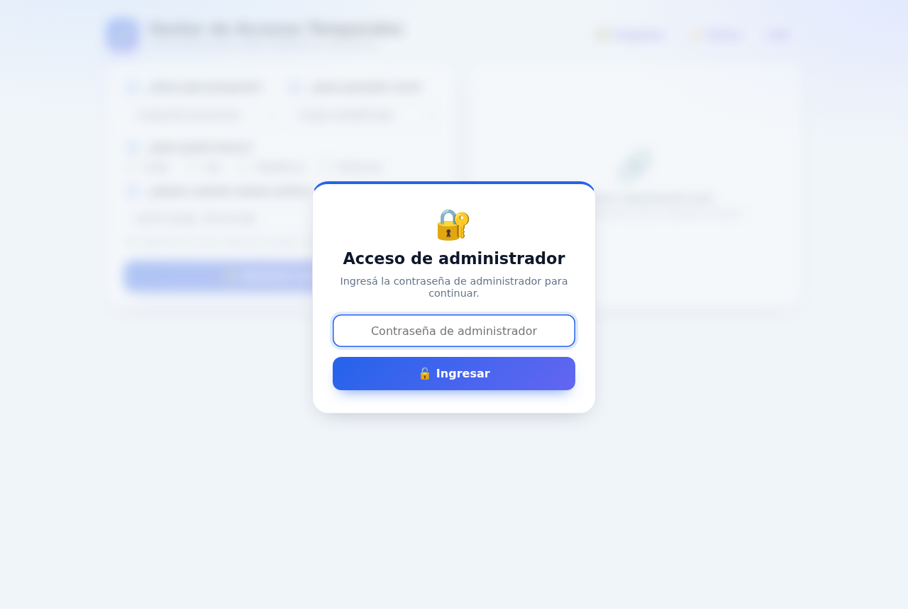
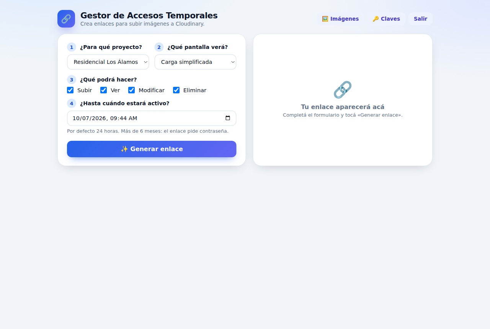
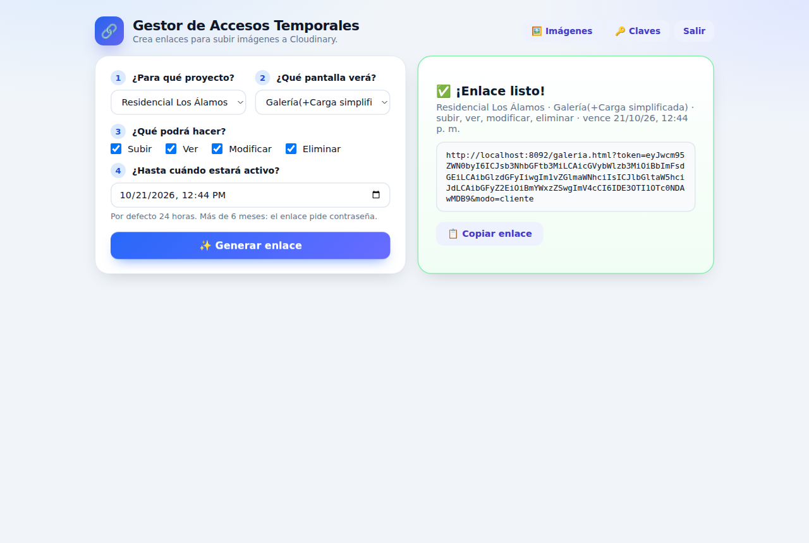
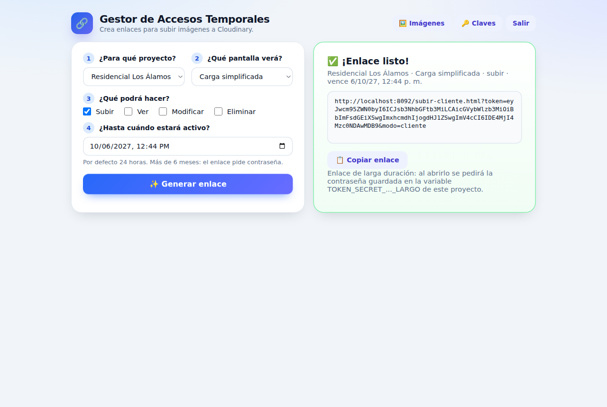
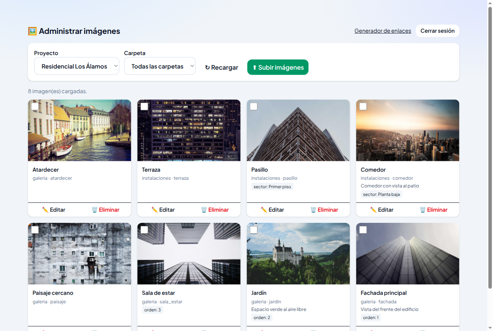
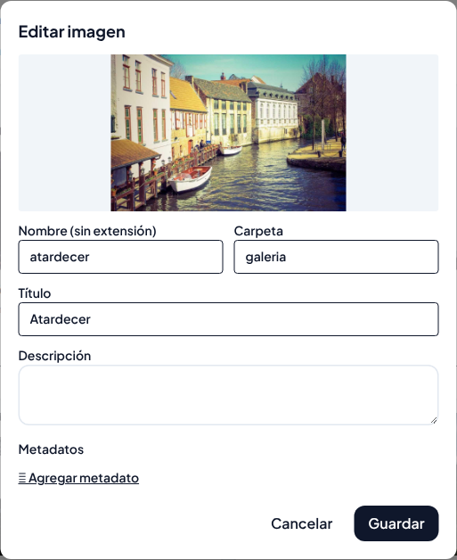
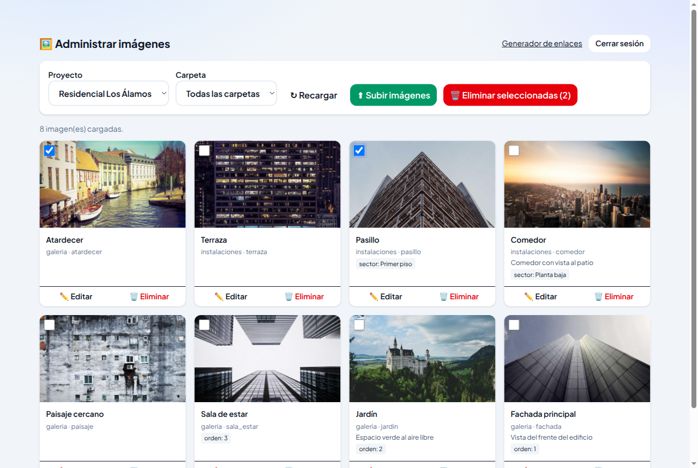
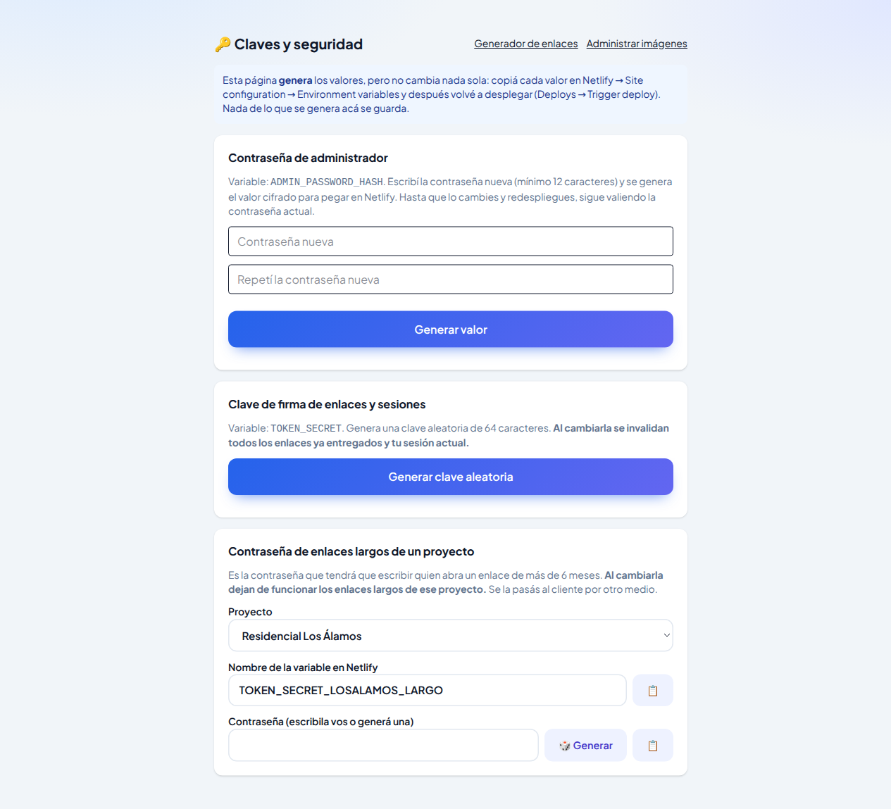

# Manual del Administrador

Cómo crear enlaces temporales para clientes y administrar las imágenes

---

## 1. Para quién es este manual

Este manual es para la persona que tiene la **contraseña de administrador** del Gestor de imágenes. El administrador puede:

- crear **enlaces temporales** para que un cliente suba, vea, edite o borre imágenes de un proyecto, sin darle usuario ni contraseña propia;
- **administrar las imágenes** de todos los proyectos: subir, editar, mover y borrar;
- generar **claves nuevas** cuando hace falta cambiarlas.

El sistema tiene tres pantallas para el administrador, conectadas por botones en la parte superior:

| Pantalla | Botón para llegar | Para qué sirve |
|---|---|---|
| **Gestor de Accesos Temporales** | *Generador de enlaces* | Crear enlaces para clientes. Es la pantalla de inicio. |
| **Administrar imágenes** | *🖼️ Imágenes* | Ver y manejar las imágenes de cada proyecto. |
| **Claves y seguridad** | *🔑 Claves* | Generar contraseñas y claves nuevas. |

Los clientes tienen sus propios manuales, según el tipo de enlace que les envíes:

- *Manual del Cliente: Enlace de carga simplificada*
- *Manual del Cliente: Enlace de galería*
- *Manual del Cliente: Enlace de carga completa*

## 2. Ingresar

1. Abrí la dirección del sitio.
2. Aparece **"Acceso de administrador"**. Escribí la contraseña y tocá **"🔓 Ingresar"**.

La sesión dura **dos horas** y queda abierta solo en esa pestaña del navegador. Cuando vence, aparece **"La sesión venció. Ingresá de nuevo."**: volvé a escribir la contraseña.

Para salir antes, tocá **Salir** (en el generador) o **Cerrar sesión** (en el panel de imágenes). Hacelo siempre en computadoras compartidas.

## 3. Crear un enlace para un cliente

El generador tiene cuatro pasos numerados.

### Paso 1: ¿Para qué proyecto?

Elegí el proyecto. Al elegirlo, se marcan los permisos que ese proyecto tiene por defecto (podés cambiarlos en el paso 3).

### Paso 2: ¿Qué pantalla verá?

Elegí qué va a ver el cliente al abrir el enlace:

| Opción | Qué ve el cliente | Para quién conviene |
|---|---|---|
| **Carga simplificada** | Solo la pantalla para subir imágenes: carpeta, imágenes y botón *Subir todas*. | Clientes que solo tienen que mandar fotos. Es la opción más simple. |
| **Galería (+Carga simplificada)** | La galería con las imágenes del proyecto. Si tiene permiso para subir, un botón lleva a la carga simplificada. | Clientes que tienen que ver, ordenar, corregir o borrar imágenes. |
| **Carga completa (+Galería)** | La carga con opciones de tamaño, calidad, título global y descarga. Si tiene permiso para ver, un botón lleva a la galería. | Personas con más experiencia que quieren controlar cómo se guardan las imágenes. |

### Paso 3: ¿Qué podrá hacer?

Marcá los permisos:

| Permiso | Qué habilita |
|---|---|
| **Subir** | Agregar imágenes nuevas. |
| **Ver** | Ver las imágenes que ya tiene el proyecto. |
| **Modificar** | Cambiar nombre, carpeta, título, descripción y etiquetas de imágenes existentes. |
| **Eliminar** | Borrar imágenes. Borrar no se puede deshacer. |

Reglas que controla la pantalla:

- Hay que marcar al menos un permiso (*"Elegí al menos un permiso."*).
- **Galería** necesita **Ver**. Al elegir Galería, *Ver* se marca solo.
- **Carga simplificada** y **Carga completa** necesitan **Subir**.

Combinaciones habituales:

| Necesidad del cliente | Pantalla | Permisos |
|---|---|---|
| Solo mandar fotos | Carga simplificada | Subir |
| Mirar las fotos, sin tocar nada | Galería | Ver |
| Mandar fotos y ver lo que ya hay | Galería | Ver + Subir |
| Corregir títulos y ordenar, sin borrar | Galería | Ver + Modificar (y Subir si también agrega) |
| Manejar todo el proyecto | Galería | Ver + Subir + Modificar + Eliminar |
| Subir con control de tamaño y calidad | Carga completa | Subir (y Ver para que pueda pasar a la galería) |

> En **Carga simplificada** el cliente no ve la galería, así que *Ver*, *Modificar* y *Eliminar* no le agregan ningún botón. Para ese tipo de enlace, marcá solo **Subir**.

Da solo los permisos que el cliente necesita. **Eliminar** conviene darlo solo a quien realmente tenga que borrar imágenes.

### Paso 4: ¿Hasta cuándo estará activo?

Elegí fecha y hora de vencimiento. Por defecto aparece **24 horas** desde ahora. El enlace puede durar desde un minuto hasta cinco años.

- **Hasta seis meses**: el cliente abre el enlace y entra directamente.
- **Más de seis meses**: es un **enlace largo**. Al abrirlo, el cliente tiene que escribir una **contraseña del proyecto** (ver la sección 4).

### Generar y enviar el enlace

1. Tocá **"✨ Generar enlace"**.
2. A la derecha aparece **"✅ ¡Enlace listo!"**, con un resumen (proyecto, pantalla, permisos y vencimiento) y el enlace.
3. Tocá **"📋 Copiar enlace"** y pegalo en el correo o mensaje para el cliente.
4. Mandale también el manual del cliente que corresponde a la pantalla elegida.

Copiá siempre el enlace con el botón. Si se corta al pegarlo, al cliente le va a aparecer *"Enlace no válido"*.

## 4. Enlaces largos (más de seis meses)

Cuando el vencimiento supera los seis meses, debajo del enlace aparece el aviso **"Enlace de larga duración: al abrirlo se pedirá la contraseña…"**.

Qué tenés que saber:

- Cada proyecto tiene **una** contraseña para sus enlaces largos. Se crea en **🔑 Claves** (sección 7).
- Si el proyecto todavía no tiene esa contraseña, el generador muestra un error y no crea el enlace. Primero hay que crearla.
- Pasale la contraseña al cliente **por un medio distinto** al del enlace (por ejemplo, el enlace por correo y la contraseña por teléfono).
- Si cambiás la contraseña de un proyecto, **dejan de funcionar todos los enlaces largos** de ese proyecto. Habrá que avisar a los clientes y darles la nueva.

## 5. Cuándo deja de funcionar un enlace

Un enlace deja de funcionar:

- cuando llega su fecha de vencimiento;
- si es un enlace largo y se cambia la contraseña de enlaces largos del proyecto;
- si se cambia la *clave de firma de enlaces y sesiones* en **🔑 Claves**: en ese caso dejan de funcionar **todos** los enlaces entregados, de todos los proyectos.

La pantalla no tiene una opción para anular un enlace puntual antes de que venza. Por eso conviene usar vencimientos cortos, sobre todo cuando el enlace permite **Eliminar**.

## 6. Administrar imágenes

Tocá **🖼️ Imágenes** en el generador para abrir **"Administrar imágenes"**. Acá el administrador tiene todos los permisos sobre todos los proyectos.

### Ver las imágenes

- **Proyecto**: elegí el proyecto.
- **Carpeta**: *Todas las carpetas* o una en particular.
- **↻ Recargar**: vuelve a leer las imágenes.
- **Cargar más**: aparece abajo cuando hay más imágenes.

Cada imagen muestra título, carpeta, nombre, descripción y etiquetas.

### Subir imágenes

1. Tocá **"⬆ Subir imágenes"**.
2. Se abre en otra pestaña la pantalla de **carga completa** del proyecto elegido, con un acceso que dura dos horas.
3. Elegí carpeta, tamaño y calidad, agregá las imágenes y subilas. Está explicado en el *Manual del Cliente: Enlace de carga completa*.
4. Volvé a la pestaña del panel y tocá **↻ Recargar** para ver las imágenes nuevas.

### Editar o mover una imagen

1. Tocá **"✏️ Editar"** en la imagen.
2. Cambiá lo que necesites: **Nombre**, **Carpeta** (para moverla), **Título**, **Descripción** o **Metadatos** (*＋ Agregar metadato* / *✕* para quitar).
3. Tocá **Guardar**.

Si un valor numérico ya lo usa otra imagen de la misma carpeta, el panel avisa y pregunta si querés guardar igual.

### Eliminar imágenes

- **Una**: tocá **"🗑 Eliminar"** en la imagen y confirmá.
- **Varias**: marcá las casillas de las imágenes y tocá **"🗑 Eliminar seleccionadas (N)"**.

La eliminación no se puede deshacer y puede afectar al sitio web que usa esas imágenes.

## 7. Claves y seguridad

Tocá **🔑 Claves** para abrir **"Claves y seguridad"**. Esta pantalla **genera** valores nuevos, pero no los aplica sola: después alguien tiene que cargarlos en la configuración del sitio en Netlify y volver a publicarlo, como indica el recuadro azul. Si eso no lo hacés vos, pasale el valor al responsable técnico por un medio seguro.

Nada de lo que se genera en esta pantalla queda guardado.

| Sección | Para qué sirve | Qué pasa al aplicarla |
|---|---|---|
| **Contraseña de administrador** | Cambiar la contraseña para entrar. Escribí la nueva dos veces (mínimo 12 caracteres) y tocá **Generar valor**. | Hasta que se aplica, sigue valiendo la contraseña actual. |
| **Clave de firma de enlaces y sesiones** | Generar una clave nueva con **Generar clave aleatoria**. | Dejan de funcionar **todos** los enlaces entregados y tu sesión. Usala si sospechás que un enlace llegó a quien no debía. |
| **Contraseña de enlaces largos de un proyecto** | Elegí el proyecto, escribí una contraseña o tocá **🎲 Generar**, y copiala con **📋**. Es la que vas a pasarle al cliente. | Dejan de funcionar los enlaces largos de ese proyecto. |

Cuidados:

- No mandes estos valores por el mismo medio que los enlaces ni los guardes en documentos compartidos.
- Después de generar un valor, copialo con **📋** antes de salir de la página.

## 8. Problemas frecuentes

| Qué pasa | Qué hacer |
|---|---|
| **"La sesión venció. Ingresá de nuevo."** | Pasaron dos horas. Volvé a escribir la contraseña. |
| **"Contraseña incorrecta"** al ingresar | Revisá la contraseña de administrador. |
| **"La galería necesita el permiso 'Ver imágenes'."** | Marcá **Ver**. |
| **"Esa pantalla de carga necesita el permiso 'Subir imágenes'."** | Marcá **Subir** o elegí **Galería**. |
| Error al generar un enlace de más de seis meses | El proyecto no tiene contraseña de enlaces largos. Creala en **🔑 Claves** y pedí que se aplique. |
| **"Vencimiento inválido"** | Elegí una fecha entre un minuto y cinco años desde ahora. |
| El cliente dice que el enlace no funciona | Revisá que lo haya copiado completo y que no haya vencido. Si hace falta, generá uno nuevo. |
| El cliente no ve un botón que necesita | El enlace no tiene ese permiso o es de otra pantalla. Generá uno nuevo con la pantalla y los permisos correctos. |

## 9. Buenas prácticas

- Usá el vencimiento más corto que sirva para el trabajo.
- Elegí la pantalla más simple: **Carga simplificada** para quien solo manda fotos.
- Da **Eliminar** solo cuando sea necesario.
- Para enlaces largos, mandá la contraseña por otro medio.
- Cerrá la sesión al terminar, sobre todo en computadoras compartidas.
- Si sospechás que un enlace llegó a otra persona, cambiá la clave correspondiente en **🔑 Claves**.
