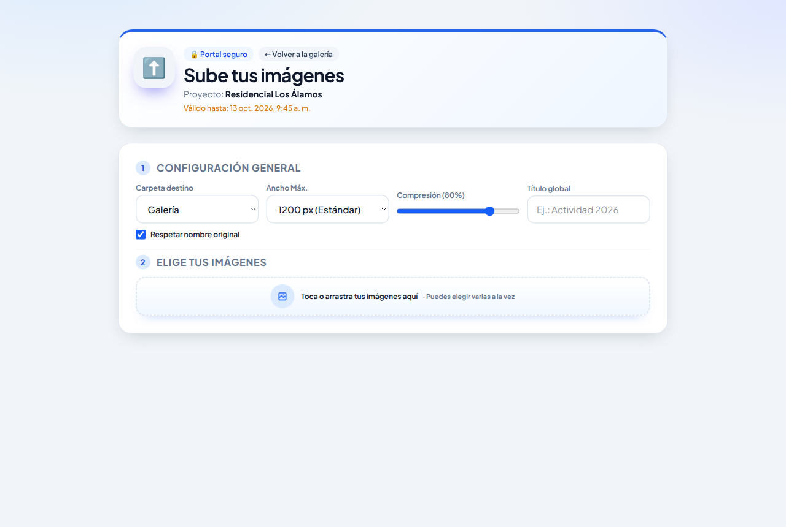
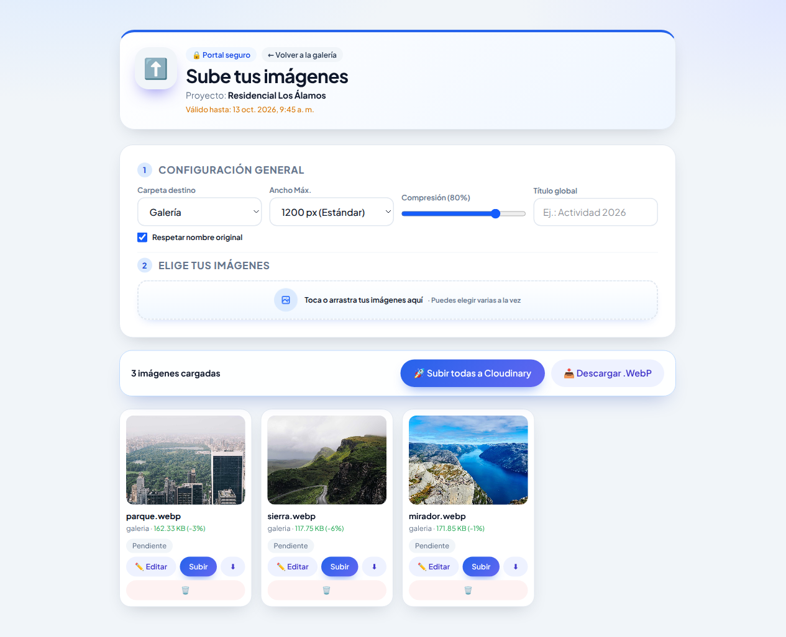
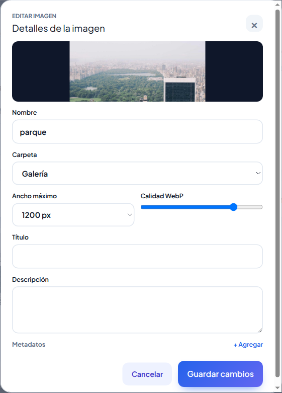

# Manual del Cliente: Enlace de carga completa

Cómo subir imágenes con opciones de tamaño, calidad y nombre

---

## 1. Para quién es este manual

Este manual es para quien recibió un **enlace de carga completa**. Al abrirlo se ve la pantalla **"Sube tus imágenes"** con una sección **"Configuración general"** (carpeta, ancho máximo, compresión y título global).

Con este enlace podés:

- elegir la carpeta del proyecto;
- decidir el tamaño y la calidad con que se guardan las imágenes;
- poner un título a todas las imágenes de una vez;
- revisar y editar cada imagen antes de subirla;
- descargar las imágenes ya optimizadas a tu equipo;
- y, si el administrador te dio permiso para ver, **volver a la galería** del proyecto.

No necesitás usuario ni instalar nada: alcanza con abrir el enlace en el navegador, en la computadora o en el celular.

## 2. Abrir el enlace

Abrí el enlace que te enviaron. Arriba se ven el **Proyecto** y la fecha **Válido hasta**, después de la cual el enlace deja de funcionar.

Si al lado de *Portal seguro* aparece **"← Volver a la galería"**, tu enlace también permite ver las imágenes del proyecto. Para usar la galería, consultá el *Manual del Cliente: Enlace de galería*.

### Si te pide una contraseña

Los enlaces de más de seis meses piden una contraseña la primera vez. En el cartel **"Acceso protegido"**, escribí la contraseña que te dio el administrador por otro medio y tocá **"🔓 Desbloquear acceso"**.

Mientras no cierres la pestaña, no te la vuelve a pedir, aunque pases de la galería a la carga y viceversa.

### Si aparece "Enlace no válido o caducado"

El enlace venció o está incompleto. Pedile uno nuevo al administrador.

## 3. Configuración general (paso 1)

Estas opciones se aplican a todas las imágenes de la lista. Conviene elegirlas **antes** de agregar las imágenes.

| Opción | Qué hace |
|---|---|
| **Carpeta destino** | Dónde se guardan las imágenes. **"+ Nueva carpeta…"** crea una carpeta nueva (algunos proyectos solo aceptan las de la lista). |
| **Ancho Máx.** | Ancho máximo de la imagen: 800 px (liviana), 1200 px (estándar, la opción por defecto), 1600 px, 1920 px (alta) u *Original* (sin achicar). Las imágenes más chicas que ese ancho no se agrandan. |
| **Compresión** | Calidad de la imagen, de 10 % a 100 % (por defecto 80 %). Menos calidad = archivo más liviano. |
| **Título global** | Un título que se pone a las imágenes que agregues después de escribirlo (por ejemplo "Actividad 2026"). |
| **Respetar nombre original** | Si está marcado, cada imagen conserva el nombre de su archivo. Si lo desmarcás, se nombra con la fecha y hora de la foto seguida de "_imagen". |

Las imágenes siempre se guardan en formato **WebP**, que pesa menos y se ve bien en la web.

## 4. Elegir y revisar las imágenes (paso 2)

1. Tocá el recuadro **"Toca o arrastra tus imágenes aquí"** y elegí una o varias imágenes, o arrastralas y soltalas sobre el recuadro.
2. Aparece una barra con la cantidad de imágenes cargadas y una tarjeta por imagen.

Cada tarjeta muestra:

- el nombre con que se va a guardar (o el título, si tiene);
- la carpeta y el **peso final** con el porcentaje de ahorro (en verde si queda más liviana que el original);
- el estado: **Pendiente**, **Subiendo…**, **✓ Éxito** o **Error ✕**.

Y estos botones:

| Botón | Para qué sirve |
|---|---|
| **✏️ Editar** (o tocar la miniatura) | Abre los detalles de esa imagen (sección 5). |
| **Subir** | Sube solo esa imagen. |
| **⬇** | Descarga a tu equipo esa imagen ya optimizada, sin subirla. |
| **🗑** | La quita de la lista. No borra nada de tu equipo ni del proyecto. |

## 5. Detalles de cada imagen

Con **✏️ Editar** se abre **"Detalles de la imagen"**. Acá podés cambiar, solo para esa imagen:

- **Nombre** del archivo.
- **Carpeta** (distinta de la general, si hace falta).
- **Ancho máximo** y **Calidad WebP**.
- **Título** y **Descripción**.
- **Metadatos**: etiquetas con valor, por ejemplo *sector: Planta baja*. **"+ Agregar"** suma una y **×** la quita. La página sugiere etiquetas y valores que ya existen en el proyecto.

Tocá **"Guardar cambios"** para aplicar o **Cancelar** para salir sin cambios.

Reglas de las etiquetas: cada etiqueta necesita un valor; no se puede repetir la misma etiqueta con el mismo valor; y un valor numérico (por ejemplo *orden: 4*) no puede estar usado por otra imagen. Para las etiquetas numéricas la página sugiere el siguiente número libre.

> Si después de editar una imagen cambiás el **Ancho Máx.**, la **Compresión** o la **Carpeta destino** generales, el cambio se aplica a todas las imágenes de la lista, incluida esa.

## 6. Subir o descargar

- **"🚀 Subir todas a Cloudinary"**: sube todas las imágenes de la lista, una tras otra.
- **"📥 Descargar .WebP"**: descarga a tu equipo todas las imágenes optimizadas, sin subirlas. Sirve para guardar una copia o usarlas en otro lado.

Cuando una imagen dice **✓ Éxito**, ya quedó guardada en el proyecto. Si alguna falla, aparece un cartel **"No se pudieron subir algunas imágenes"** con el nombre y el motivo; las demás se suben igual.

## 7. Si algo sale mal

| Qué ves | Qué hacer |
|---|---|
| **Enlace no válido o caducado** | Pedí un enlace nuevo al administrador. |
| **Contraseña incorrecta** | Revisá la contraseña. Si no la tenés, pedila al administrador. |
| **"Ya existe una imagen con ese nombre en la carpeta"** | Cambiá el **Nombre** en **✏️ Editar** y volvé a tocar **Subir**. |
| **"Hay etiquetas o valores numéricos repetidos"** | Revisá los metadatos de la imagen. |
| Error de carpeta | Elegí una carpeta de la lista en lugar de una nueva. |
| La subida se corta | Revisá la conexión y tocá **Subir** en las tarjetas que no dicen *Éxito*. |

## 8. Consejos

- Para la web, **1200 px** y **80 %** suelen ser un buen equilibrio entre calidad y peso.
- Elegí la configuración general y el título global **antes** de agregar las imágenes.
- Revisá la carpeta antes de subir.
- No reenvíes el enlace: quien lo tenga puede subir imágenes al proyecto (y verlas, si el enlace lo permite).
