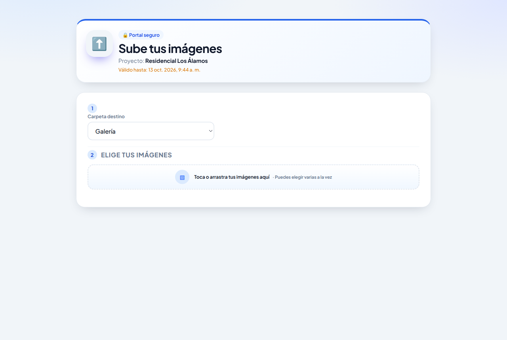
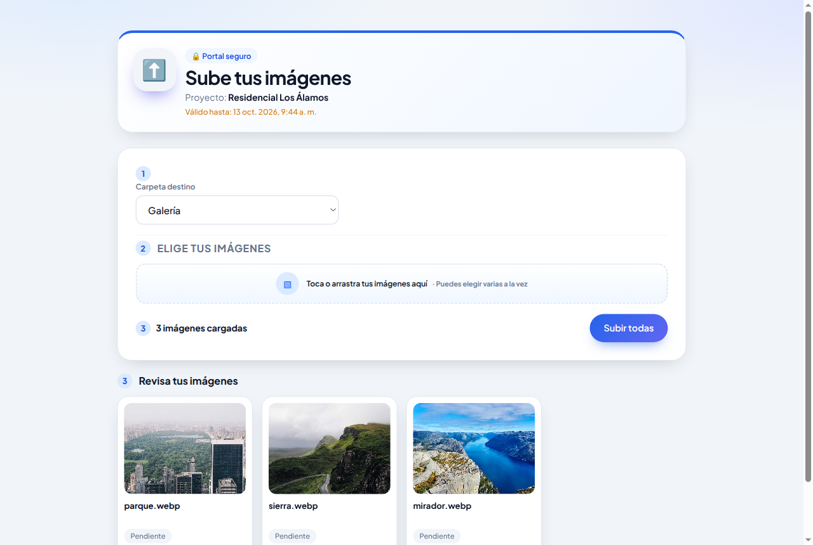
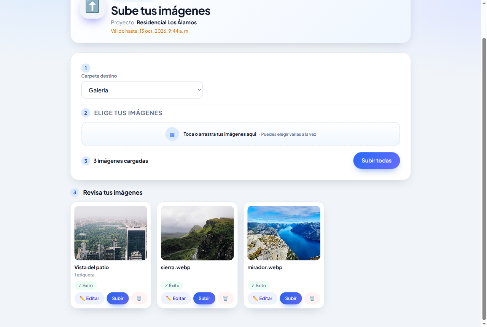
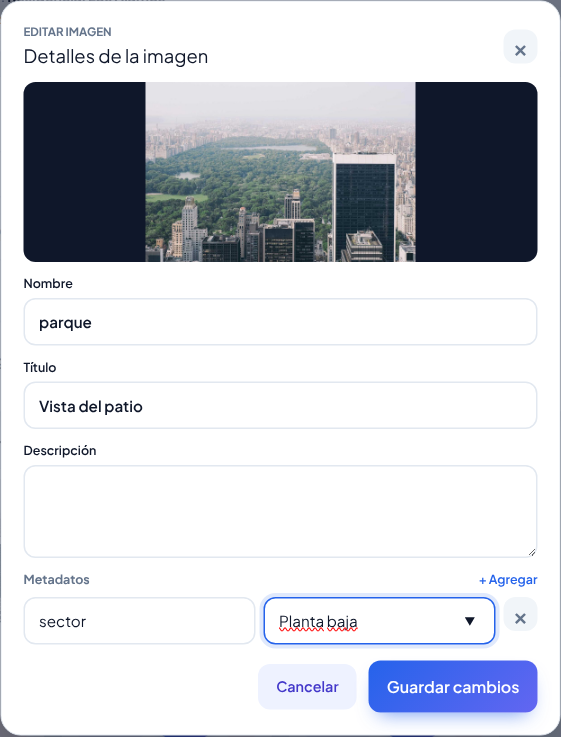

# Manual del Cliente: Enlace de carga simplificada

Cómo subir imágenes con el enlace que te envió el administrador

---

## 1. Para quién es este manual

Este manual es para quien recibió un **enlace para subir imágenes** y, al abrirlo, ve la pantalla **"Sube tus imágenes"** con dos pasos: *Carpeta destino* y *Elige tus imágenes*.

Con este enlace podés:

- elegir en qué carpeta del proyecto van las imágenes;
- elegir una o varias imágenes de tu computadora o celular;
- revisar cada imagen y, si querés, cambiarle el nombre o agregarle un título, una descripción o etiquetas;
- subirlas.

Con este enlace **no** se ven las imágenes que ya están en el proyecto, ni se pueden borrar o cambiar imágenes ya subidas. Si necesitás eso, pedile al administrador un enlace de galería.

No necesitás usuario ni instalar nada: alcanza con abrir el enlace en el navegador (Chrome, Edge, Firefox, Safari), en la computadora o en el celular.

## 2. Abrir el enlace

1. Abrí el enlace que te enviaron (por correo, WhatsApp u otro medio).
2. Aparece la pantalla **"Sube tus imágenes"**. Arriba se muestran:
   - **Proyecto**: el nombre del proyecto donde se van a guardar las imágenes.
   - **Válido hasta**: la fecha y hora en que el enlace deja de funcionar.

### Si te pide una contraseña

Los enlaces que duran mucho tiempo (más de seis meses) piden una contraseña la primera vez que se abren. Aparece el cartel **"Acceso protegido"**.

1. Escribí la contraseña que te dio el administrador. Te la tiene que haber pasado por un medio distinto al del enlace.
2. Tocá **"🔓 Desbloquear acceso"**.

Si aparece **"Contraseña incorrecta"**, revisá mayúsculas, minúsculas y espacios, y volvé a intentar. Mientras no cierres la pestaña, no te la vuelve a pedir.

### Si aparece "Enlace no válido o caducado"

El enlace venció o está incompleto (por ejemplo, si se cortó al copiarlo). Pedile un enlace nuevo al administrador.

## 3. Subir imágenes paso a paso

### Paso 1: elegir la carpeta

En **Carpeta destino** elegí dónde van las imágenes (por ejemplo *Galería* o *Instalaciones*). La página recuerda la última carpeta que usaste.

La opción **"+ Nueva carpeta…"** pide un nombre y crea una carpeta nueva. Usala solo si el administrador te lo indicó: algunos proyectos solo aceptan las carpetas de la lista, y en ese caso la subida va a dar error.

### Paso 2: elegir las imágenes

Tocá el recuadro **"Toca o arrastra tus imágenes aquí"** y elegí una o varias imágenes. En la computadora también podés arrastrarlas desde una carpeta y soltarlas sobre el recuadro.

Podés repetir este paso para agregar más imágenes a la lista.

### Paso 3: revisar las imágenes

Abajo aparece **"Revisa tus imágenes"**, con una tarjeta por imagen. Cada tarjeta muestra la miniatura, el nombre con que se va a guardar y el estado (**Pendiente** mientras no se subió).

En cada tarjeta tenés:

| Botón | Para qué sirve |
|---|---|
| **✏️ Editar** (o tocar la miniatura) | Abre los detalles de la imagen (ver la sección 4). |
| **Subir** | Sube solo esa imagen. |
| **🗑** | La quita de la lista. No borra nada de tu equipo ni del proyecto. |

### Paso 4: subir

Tocá **"Subir todas"** (arriba, al lado de la cantidad de imágenes cargadas) o el botón **Subir** de cada tarjeta.

Antes de subirlas, la página achica y optimiza las imágenes automáticamente para que pesen menos. No tenés que hacer nada.

El estado de cada tarjeta cambia a **Subiendo…** y después a **✓ Éxito**. Cuando todas dicen *Éxito*, ya está: las imágenes quedaron en el proyecto.

## 4. Agregar título, descripción o etiquetas (opcional)

Tocá **✏️ Editar** en una tarjeta para abrir **"Detalles de la imagen"**:

- **Nombre**: el nombre del archivo. Si ya existe una imagen con el mismo nombre en esa carpeta, la subida falla; en ese caso cambialo acá.
- **Título**: un texto corto que puede mostrarse junto a la imagen (por ejemplo, "Vista del patio").
- **Descripción**: un texto más largo sobre la imagen.
- **Metadatos**: etiquetas con un valor, por ejemplo *sector: Planta baja*. Tocá **"+ Agregar"** para sumar una, escribí la etiqueta y el valor, y tocá **×** para quitarla. Al escribir, la página te sugiere etiquetas y valores que ya se usan en el proyecto.

Tocá la vista previa para verla en grande unos segundos.

Para terminar, tocá **"Guardar cambios"**. Con **Cancelar** o **×** se cierra sin guardar. Los cambios se aplican cuando subas la imagen.

Reglas de las etiquetas:

- cada etiqueta necesita su valor (o hay que quitarla);
- no se puede repetir la misma etiqueta con el mismo valor en una imagen;
- si el valor es un número (por ejemplo *orden: 4*), no puede estar usado por otra imagen. Si elegís una etiqueta numérica, la página sugiere el siguiente número libre.

## 5. Si algo sale mal

| Qué ves | Qué hacer |
|---|---|
| **Enlace no válido o caducado** | El enlace venció o está incompleto. Pedí uno nuevo al administrador. |
| **Contraseña incorrecta** | Revisá la contraseña y volvé a escribirla. Si no la tenés, pedila al administrador. |
| Una tarjeta dice **Error ✕** | Aparece un cartel con el motivo. Corregí lo que indica (por ejemplo, el nombre) y tocá **Subir** otra vez en esa tarjeta. Las demás imágenes se suben igual. |
| **"Ya existe una imagen con ese nombre en la carpeta"** | Abrí **✏️ Editar**, cambiá el **Nombre** y volvé a subir. |
| **"Hay etiquetas o valores numéricos repetidos"** | Revisá las etiquetas de la imagen (sección 4). |
| Error de carpeta | Elegí una carpeta de la lista en lugar de una nueva. |
| La subida se corta | Revisá tu conexión a internet y volvé a tocar **Subir** en las tarjetas que no dicen *Éxito*. |

## 6. Consejos

- Antes de subir, revisá que la **carpeta** sea la correcta: después no la vas a poder cambiar con este enlace.
- Fijate la fecha de **Válido hasta**. Después de esa fecha el enlace deja de funcionar.
- No reenvíes el enlace a otras personas: quien lo tenga puede subir imágenes al proyecto.
- Si tenés muchas imágenes, podés subirlas en tandas.
