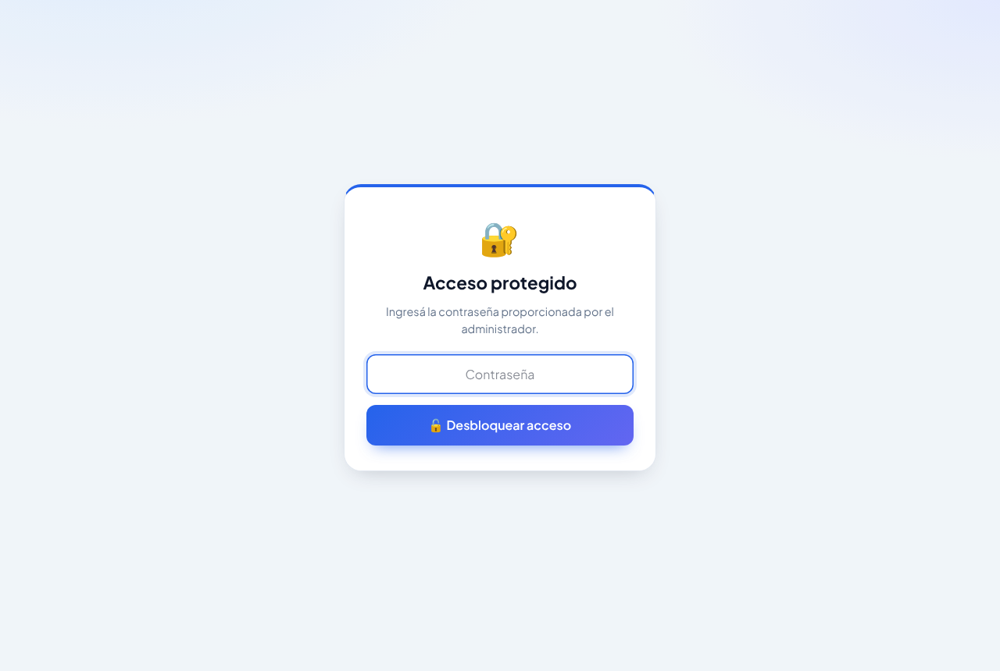
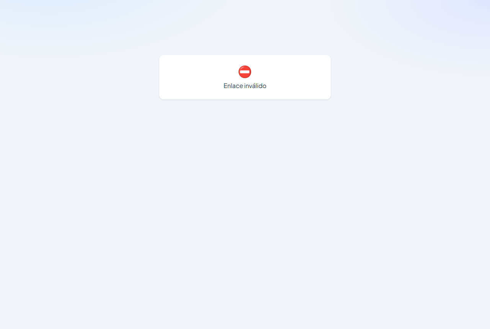
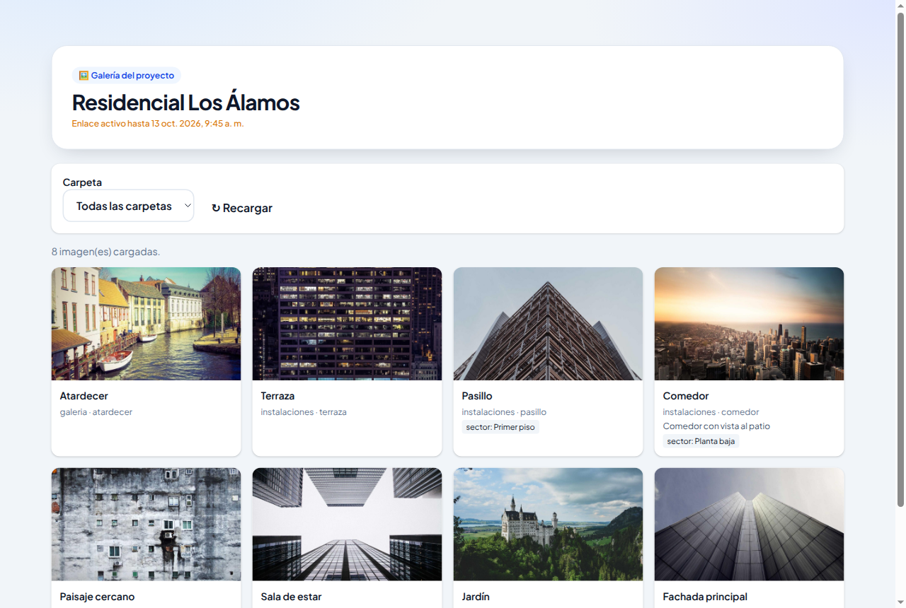
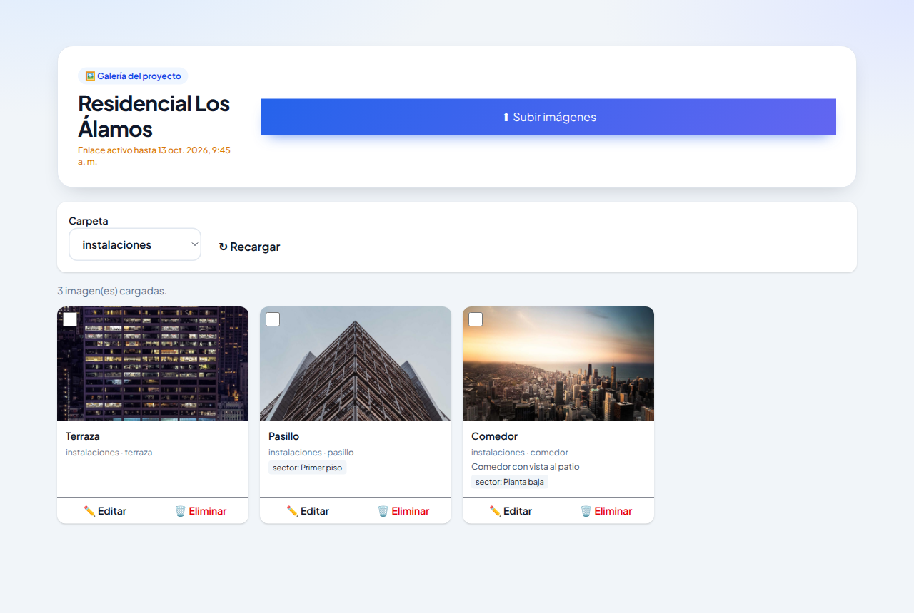
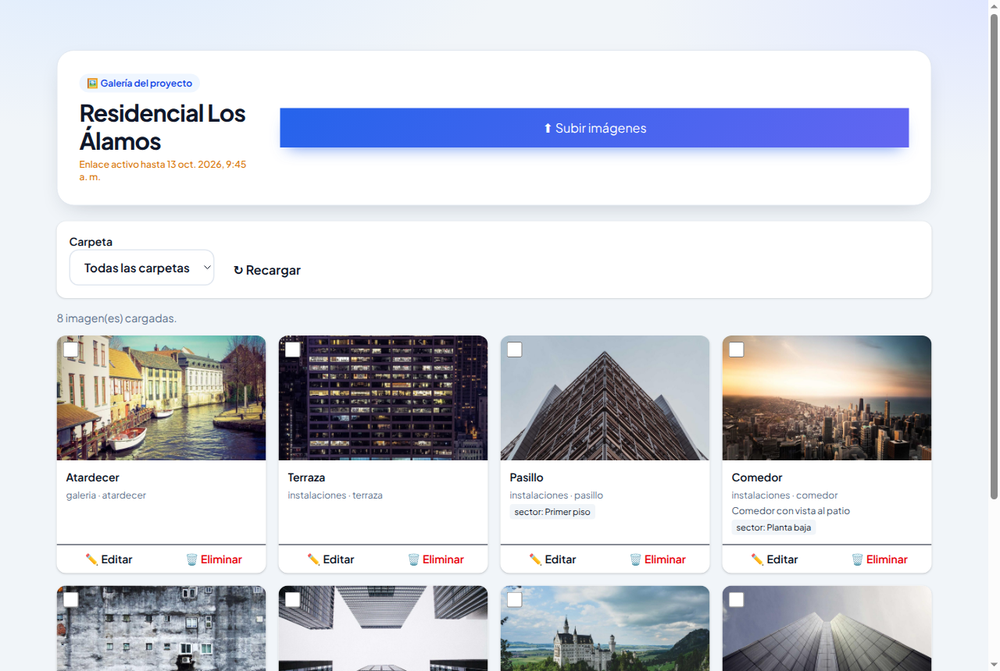
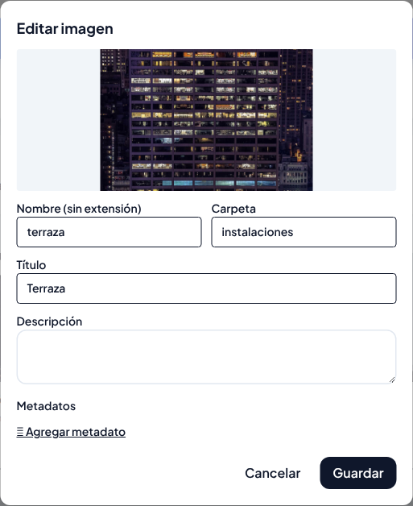
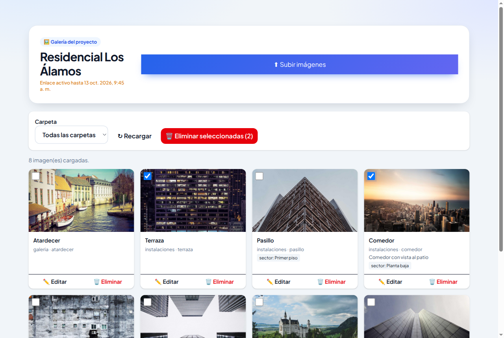

# Manual del Cliente: Enlace de galería

Cómo ver, ordenar, editar, borrar y subir imágenes del proyecto

---

## 1. Para quién es este manual

Este manual es para quien recibió un **enlace de galería**. Al abrirlo se ve la pantalla **"Galería del proyecto"**, con el nombre del proyecto y las imágenes que ya tiene.

Lo que podés hacer depende de los **permisos** que te dio el administrador. La pantalla muestra solo los botones que te corresponden:

| Permiso | Qué ves en pantalla | Qué podés hacer |
|---|---|---|
| **Ver** (siempre incluido) | Las imágenes, el filtro de carpeta y **↻ Recargar** | Mirar las imágenes del proyecto. |
| **Subir** | Botón **"⬆ Subir imágenes"** arriba a la derecha | Agregar imágenes nuevas. |
| **Modificar** | Botón **"✏️ Editar"** en cada imagen | Cambiar nombre, carpeta, título, descripción y etiquetas. |
| **Eliminar** | Botón **"🗑 Eliminar"** y una casilla en cada imagen | Borrar imágenes, de a una o varias juntas. |

Si un botón de esta guía no aparece en tu pantalla, es porque tu enlace no tiene ese permiso. Si lo necesitás, pedile al administrador un enlace nuevo.

> **Importante:** las imágenes de la galería son las que usa el sitio web del proyecto. Si editás o borrás una, el cambio puede verse en el sitio. Borrar no se puede deshacer.

## 2. Abrir el enlace

Abrí el enlace que te enviaron, en la computadora o en el celular. No necesitás usuario.

Arriba se ven el nombre del proyecto y **"Enlace activo hasta"**, la fecha y hora en que el enlace deja de funcionar.

### Si te pide una contraseña

Los enlaces de más de seis meses piden una contraseña la primera vez. En el cartel **"Acceso protegido"**, escribí la contraseña que te dio el administrador por otro medio y tocá **"🔓 Desbloquear acceso"**.

Mientras no cierres la pestaña, no te la vuelve a pedir, aunque pases de la galería a la pantalla de carga.

### Si aparece "Enlace inválido o vencido"

El enlace venció o está incompleto (por ejemplo, si se cortó al copiarlo). Pedile un enlace nuevo al administrador.

## 3. Ver las imágenes (permiso Ver)

Con el permiso **Ver**, la galería muestra todas las imágenes del proyecto, de la más nueva a la más vieja.

Cada imagen muestra:

- el **título** (o el nombre, si no tiene título);
- la **carpeta** y el **nombre** del archivo;
- la **descripción**, si tiene;
- sus **etiquetas** (por ejemplo *orden: 1* o *sector: Planta baja*).

Para moverte por la galería:

- **Carpeta**: elegí una carpeta para ver solo sus imágenes, o *Todas las carpetas*.
- **↻ Recargar**: vuelve a leer las imágenes (útil si alguien subió imágenes nuevas).
- **Cargar más**: aparece abajo cuando hay más imágenes de las que entran en una página.

## 4. Galería con todos los permisos

Si tu enlace tiene todos los permisos, la galería se ve así:

### Subir imágenes (permiso Subir)

1. Tocá **"⬆ Subir imágenes"**, arriba a la derecha.
2. Se abre la pantalla **"Sube tus imágenes"**, en la misma pestaña.
3. Seguí los pasos del *Manual del Cliente: Enlace de carga simplificada*: elegí la carpeta, elegí las imágenes y tocá **Subir todas**.
4. Para ver las imágenes nuevas, volvé a la galería con el botón **Atrás** del navegador y tocá **↻ Recargar**.

### Editar una imagen (permiso Modificar)

1. Tocá **"✏️ Editar"** en la imagen.
2. Se abre **"Editar imagen"**:

| Campo | Qué cambia |
|---|---|
| **Nombre (sin extensión)** | El nombre del archivo. |
| **Carpeta** | Para **mover** la imagen a otra carpeta, escribí o elegí la carpeta nueva. |
| **Título** | El texto corto que acompaña a la imagen. |
| **Descripción** | Un texto más largo sobre la imagen. |
| **Metadatos** | Etiquetas con valor. **"＋ Agregar metadato"** suma una fila y **✕** la quita. Las filas sin etiqueta o sin valor no se guardan. |

3. Tocá **Guardar**. La galería se actualiza con los cambios. Con **Cancelar** se cierra sin guardar.

Si ponés un número que otra imagen de la misma carpeta ya usa en esa etiqueta (por ejemplo, dos imágenes con *orden: 2*), la página te avisa y te pregunta si querés guardar igual.

### Eliminar imágenes (permiso Eliminar)

**Una sola imagen:**

1. Tocá **"🗑 Eliminar"** en la imagen.
2. Confirmá en el mensaje **"¿Eliminar …? Esta acción no se puede deshacer."**

**Varias imágenes juntas:**

1. Marcá la casilla de la esquina de cada imagen que quieras borrar.
2. Arriba aparece el botón rojo **"🗑 Eliminar seleccionadas (N)"**, con la cantidad marcada.
3. Tocalo y confirmá.

Una imagen eliminada no se puede recuperar desde la galería.

## 5. Si algo sale mal

| Qué ves | Qué hacer |
|---|---|
| **Enlace inválido o vencido** | Pedí un enlace nuevo al administrador. |
| **Contraseña incorrecta** | Revisá la contraseña. Si no la tenés, pedila al administrador. |
| **"Este enlace no permite ver las imágenes"** | Tu enlace no tiene el permiso **Ver**. Pedí otro al administrador. |
| **"Este enlace no tiene permiso para esa acción"** | Intentaste algo que tu enlace no permite. |
| **"No hay imágenes en esta selección"** | La carpeta elegida está vacía. Elegí *Todas las carpetas*. |
| No ves las imágenes que subiste | Tocá **↻ Recargar**. |

## 6. Consejos

- Antes de borrar, fijate bien qué imágenes marcaste: no hay papelera.
- Si vas a cambiar el orden con una etiqueta numérica (por ejemplo *orden*), revisá que no queden números repetidos en la carpeta.
- Fijate la fecha de **Enlace activo hasta**.
- No reenvíes el enlace: quien lo tenga puede hacer lo mismo que vos.
